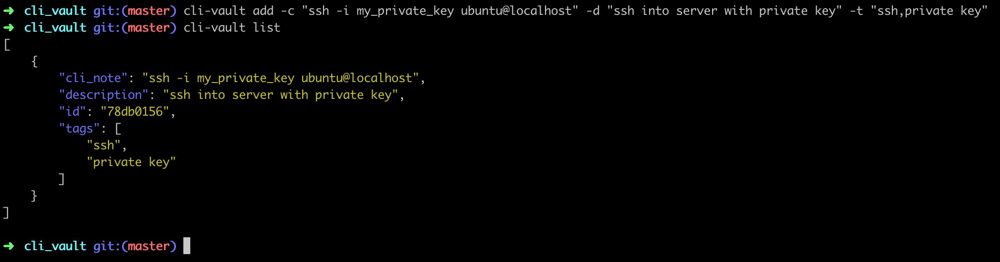
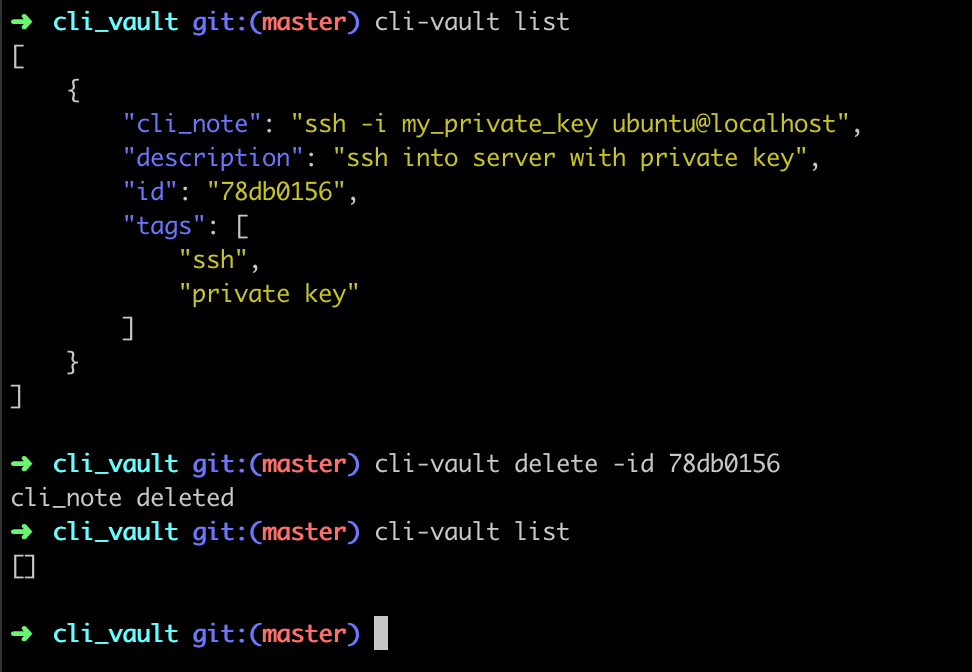
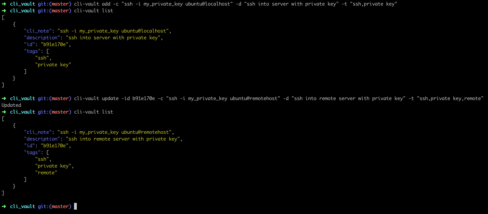
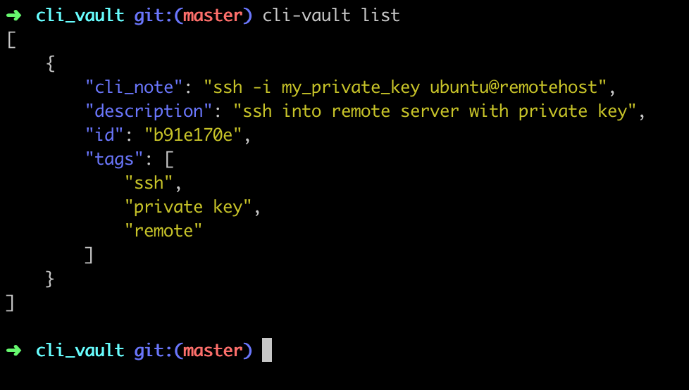
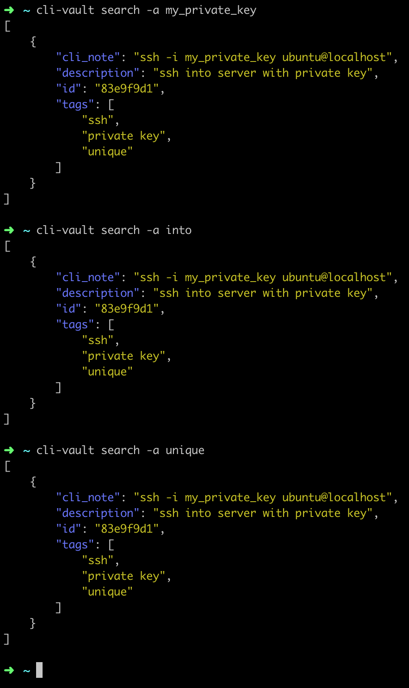
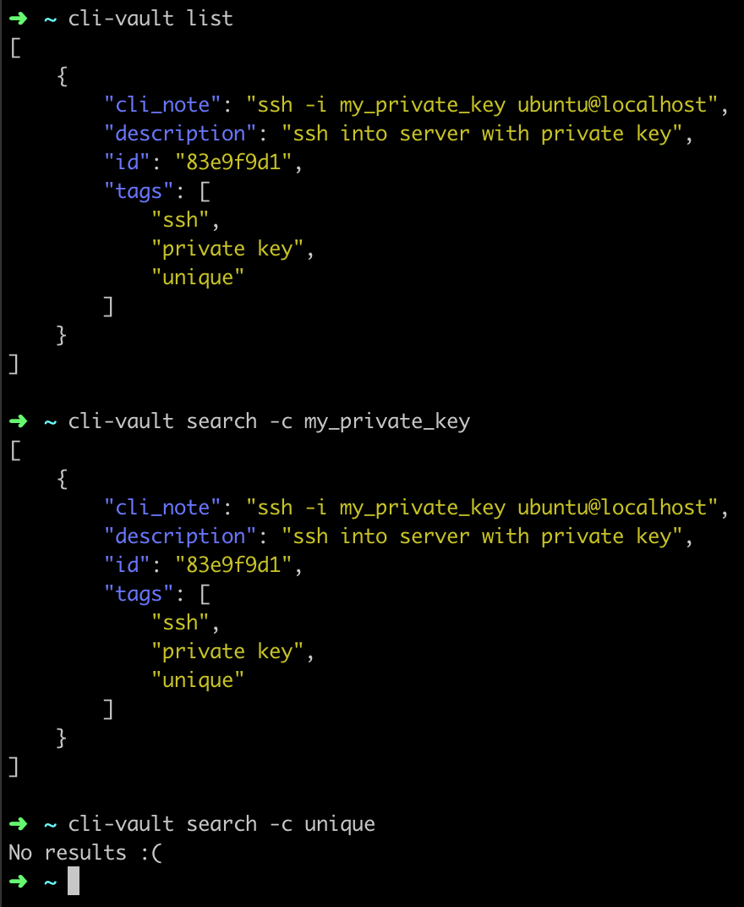
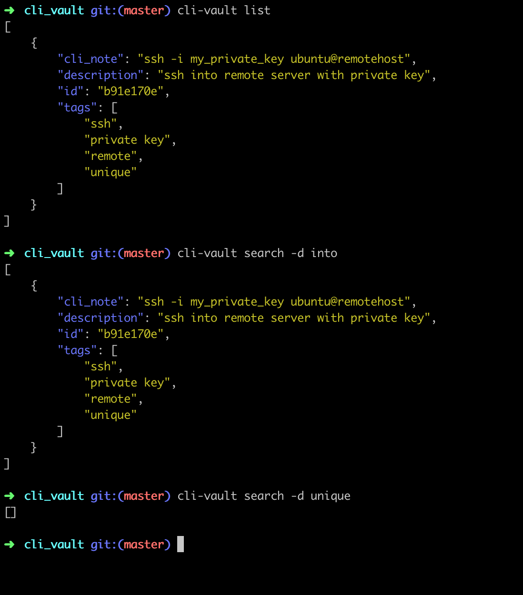
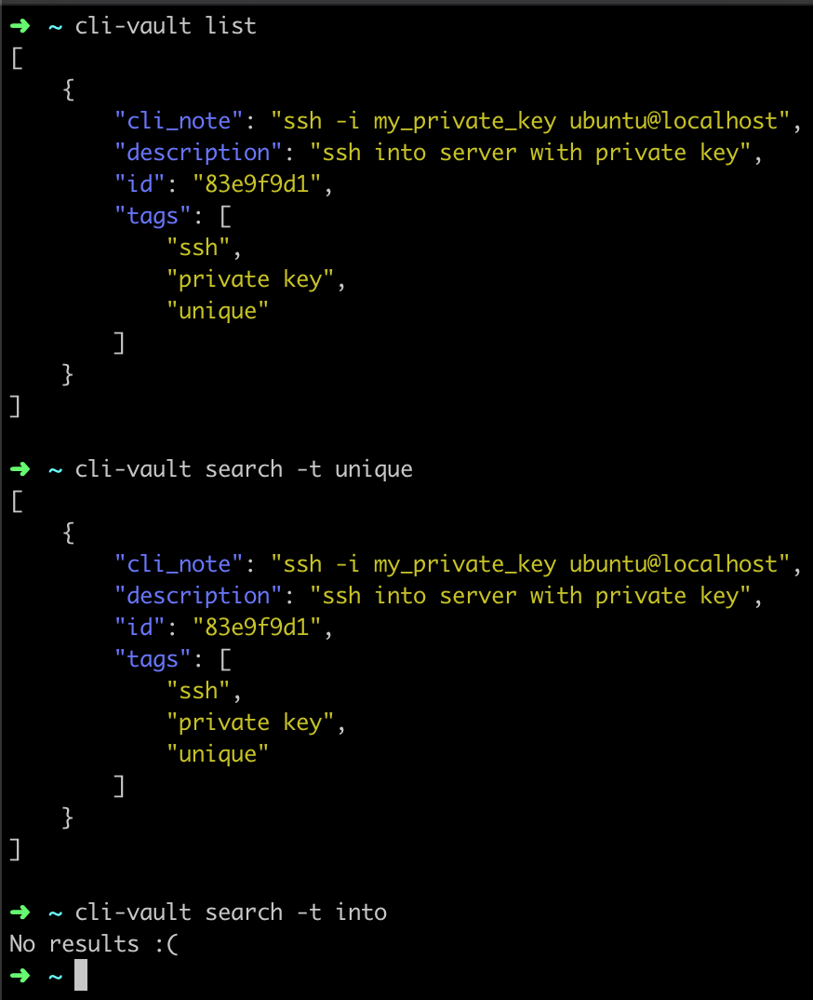

# What is it?

This tool helps developers improve productivity by managing commonly used commands and notes. 

# Why?

Sometimes we forget a command we used in the past. You can quickly store them with this tool in case you need to reference them again. You can store other information 
too such as ip addresses, api end points, links, and much more to recollect at a later time. 

Yes you can save this in a file or document but sometimes those can be misplaced.

# How to use
First run the following commands:

```sh
Install python3 on machine
pip3 install -r requirements.txt
chmod +x src/cli_vault.py
cp src/cli_vault.py /usr/local/bin/cli-vault
```

## Add a cli note:



## Delete a cli note:



## Update a cli note:



## List all the cli notes stored:



## Search for notes via cli note, description, tags, or all

This allows you to search a text individually on cli note, description, and tags or search through all of them. 

### All:

This is searching for 'into' and 'unique' in cli note, description, and tags.



### Cli Note:

This will only search for the terms on cli_note.



### Description:

This will only search for the terms on description.



### Tags:

This will only search for the terms on tags.


